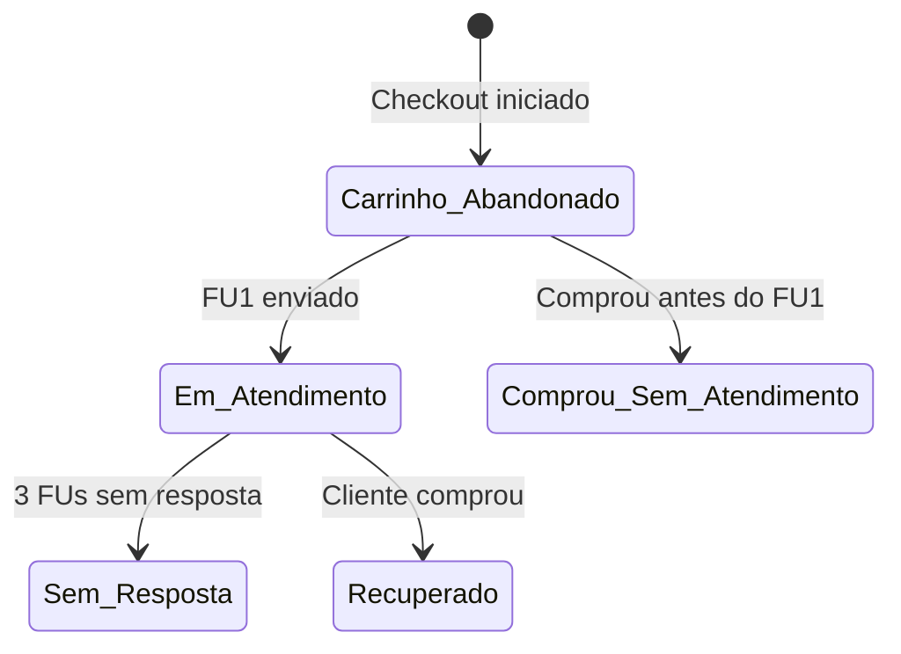

# 🚀 MVM - Sistema de Recuperação de Vendas

Sistema automatizado de recuperação de carrinhos abandonados para MVM Creators, combinando **IA conversacional** (GPT-4o-mini), **automação n8n** e **CRM customizado** para recuperar vendas via WhatsApp 24/7.

---

## 📊 Métricas do Sistema

| Métrica | Valor |
|---------|-------|
| Taxa de Recuperação | ~70% |
| Tempo de Resposta | <5 segundos |
| Leads Atendidos/Dia | 50+ |
| Operação | 24/7 automatizado |

---

## 🏗️ Arquitetura Geral

```
┌─────────────────┐     ┌─────────────────┐     ┌─────────────────┐
│   Kiwify        │────▶│   Webhook       │────▶│   Supabase      │
│   (Checkout)    │     │   Abandonado    │     │   (CRM DB)      │
└─────────────────┘     └─────────────────┘     └────────┬────────┘
                                                         │
                                                         ▼
┌─────────────────┐     ┌─────────────────┐     ┌─────────────────┐
│   WhatsApp      │◀───▶│   n8n           │◀───▶│   Redis         │
│   (Evolution)   │     │   (Orquestrador)│     │   (Buffer/Cache)│
└─────────────────┘     └────────┬────────┘     └─────────────────┘
                                 │
                        ┌────────┴────────┐
                        ▼                 ▼
              ┌─────────────────┐ ┌─────────────────┐
              │   OpenAI        │ │   Vector Store  │
              │   (Milena IA)   │ │   (RAG)         │
              └─────────────────┘ └─────────────────┘
```

---

## 🔄 Fluxo Passo a Passo

### 1️⃣ Captura do Lead (Carrinho Abandonado)

1. Cliente inicia checkout no Kiwify (MVM Brasil ou Legacy)
2. Webhook detecta carrinho abandonado
3. Lead é registrado no Supabase com `stage = carrinho_abandonado`
4. Dados capturados: nome, telefone, email, produto, timestamp

### 2️⃣ Dispatcher de Follow-ups

O workflow de **Dispatcher** executa a cada 10 minutos:

```
┌──────────────────────────────────────────────────────────────┐
│ Schedule Trigger (10 min)                                    │
│     │                                                        │
│     ▼                                                        │
│ Buscar leads com stage = "carrinho_abandonado"               │
│     │                                                        │
│     ├── Filtro: horário comercial (9h-21h)                  │
│     ├── Filtro: não respondeu ainda                         │
│     ├── Priorização: Legacy > Brasil                        │
│     │                                                        │
│     ▼                                                        │
│ Calcular timing do follow-up:                                │
│     • FU1: 2h após abandono                                  │
│     • FU2: 6h após abandono                                  │
│     • FU3: 12h após abandono                                 │
│     │                                                        │
│     ▼                                                        │
│ Agente IA gera mensagem personalizada e variada              │
│     │                                                        │
│     ▼                                                        │
│ Simular digitação + Enviar via WhatsApp                      │
│     │                                                        │
│     ▼                                                        │
│ Atualizar stage = "em_atendimento"                           │
└──────────────────────────────────────────────────────────────┘
```

### 3️⃣ Agente Principal (Milena Victoria)

Quando o lead responde, o **Agente Principal** processa:

```
┌──────────────────────────────────────────────────────────────┐
│ Webhook WhatsApp (mensagem recebida)                         │
│     │                                                        │
│     ▼                                                        │
│ Filtros anti-loop e validação                                │
│     │                                                        │
│     ├── É intervenção humana? → Desativa bot (15min)        │
│     │                                                        │
│     ▼                                                        │
│ Tratamento multimodal:                                       │
│     • Texto → direto pro buffer                             │
│     • Áudio → Transcrição OpenAI → buffer                   │
│     • Imagem → Análise GPT-4 Vision → buffer                │
│     • PDF → Extração de texto → buffer                      │
│     │                                                        │
│     ▼                                                        │
│ Buffer Redis (aguarda 120s para cliente terminar de digitar) │
│     │                                                        │
│     ▼                                                        │
│ Consulta RAG (100+ docs sobre MVM, bônus, preços, FAQ)       │
│     │                                                        │
│     ▼                                                        │
│ Agente Milena processa com contexto:                         │
│     • Memória da conversa (PostgreSQL)                       │
│     • Produto abandonado (Brasil/Legacy)                     │
│     • Histórico de mensagens                                 │
│     • Prompt de 600+ linhas                                  │
│     │                                                        │
│     ▼                                                        │
│ Humanizar resposta (quebrar em 2-3 mensagens naturais)       │
│     │                                                        │
│     ▼                                                        │
│ Simular digitação dinâmica (280ms/palavra)                   │
│     │                                                        │
│     ▼                                                        │
│ Enviar via WhatsApp + Atualizar CRM                          │
└──────────────────────────────────────────────────────────────┘
```

### 4️⃣ CRM Customizado (recuperacao.mvmcreators.com)

O CRM foi desenvolvido pela equipe MVM para gestão visual e operacional de todo o funil de recuperação. Possui interface dark mode profissional com 3 módulos principais:

#### 📊 Dashboard

Painel de métricas em tempo real com visão completa do desempenho:

**Métricas Principais (cards superiores):**
- **Total Atendidos** - Quantidade de leads que receberam follow-up
- **Respondidas** - Leads que responderam às mensagens
- **Taxa de Resposta (%)** - Percentual de engajamento
- **Taxa de Conversão (%)** - Leads convertidos em vendas
- **Ticket Médio (R$)** - Valor médio das vendas recuperadas

**Conversões do Funil:**
- Vendas FRONT (MVM Brasil - R$497)
- Vendas UPSELL (MVM Legacy - R$2.997)

**Pipeline Atual:**
Distribuição de leads por etapa em tempo real:
- 🟡 Carrinho Abandonado
- 🟢 Em Atendimento  
- 🔴 Sem Resposta
- ✅ Recuperados
- 🔵 Comprou sem Atendimento

**Evolução Diária:**
Cards com contagem do dia atual para cada etapa do funil.

**Gráfico de Evolução Temporal:**
Visualização da distribuição de clientes por etapa ao longo do tempo (últimos 7 dias), mostrando a progressão do funil.

---

#### 📋 Kanban

Visualização estilo Trello para gestão visual do pipeline:

**Colunas do Board:**
1. **Carrinho Abandonado** (🟡) - Leads que abandonaram checkout
2. **Em Atendimento** (🟢) - Milena conversando ativamente
3. **Sem Resposta** (🔴) - 3 FUs enviados sem retorno
4. **Recuperado** (✅) - Venda concluída
5. **Comprou sem Atendimento** (🔵) - Comprou antes do follow-up

**Cada Card exibe:**
- Nome do cliente
- Email
- Telefone
- Produto abandonado
- Data/hora do abandono
- Botões de ação rápida (Recuperado / Sem Resposta)
- Opção "Mover para Atendimento" (intervenção manual)

**Filtros:**
- Todos / FRONT / UPSELL

---

#### 👥 Lista de Clientes

Tabela completa com todos os leads e histórico:

**Colunas:**
| Coluna | Descrição |
|--------|-----------|
| Nome | Nome completo do lead |
| Email | Email do checkout |
| Telefone | WhatsApp com código do país |
| Documento | CPF/CNPJ |
| Produtos | MVM Brasil / Legacy / Ecossistema |
| Valor Total | Valor do carrinho |
| Etapas | Badge colorido com status atual |
| Última Atualização | Data/hora da última interação |
| Ações | Editar, visualizar, deletar |

**Funcionalidades:**
- Busca por nome, email, telefone, documento ou produto
- Filtro por etapa (dropdown)
- Ordenação por coluna
- Paginação

---

#### 🔗 Integração n8n ↔ CRM

O CRM se comunica com o n8n em tempo real:

```
n8n                                    CRM
 │                                      │
 ├── Atualiza stage ────────────────▶  Pipeline atualiza
 ├── Atualiza ultima_msg ───────────▶  Timestamp atualiza
 ├── Incrementa messages_responded ─▶  Contador atualiza
 │                                      │
 ◀── Webhook de compra ────────────────┤ Kiwify confirma
```

### 5️⃣ Contingência de Chip

Monitoramento contínuo da instância WhatsApp:

```
Schedule (1 min) → Verificar status → Se caiu → Alerta WhatsApp
```

---

## 🛠️ Stack Tecnológica

| Componente | Tecnologia |
|------------|------------|
| Orquestração | n8n (self-hosted) |
| WhatsApp | Evolution API |
| IA | OpenAI GPT-4o-mini |
| RAG | Supabase pgvector |
| Database | PostgreSQL (Supabase) |
| Cache/Buffer | Redis |
| Pagamentos | Kiwify |
| CRM | Aplicação customizada |

---

## 🤖 Persona: Milena Victoria

A agente IA foi treinada com persona de **Especialista em Recuperação de Vendas**:

- **Tom:** Profissional, acolhedora, confiante
- **Estilo:** Conversa natural de WhatsApp (não robótica)
- **Capacidades:**
  - Identifica produto abandonado (Brasil vs Legacy)
  - Consulta RAG para respostas precisas
  - Trata objeções (financeira, tempo, decisão)
  - Oferece parcelamento e garantias
  - Detecta quando cliente já comprou
  - Nunca inventa informações (anti-alucinação)

---

## 📁 Estrutura dos Workflows

```
workflows/
├── mvm-sistema-recuperacao-vendas.json   # Documentação completa
├── 01-dispatcher-followups.json          # Disparos automáticos
├── 02-agente-principal.json              # Milena (IA principal)
├── 03-vector-store-rag.json              # Subida de conhecimento
├── 04-contingencia-chip.json             # Monitoramento WhatsApp
└── README.md                             # Este arquivo
```

---

## 📈 Pipeline de Leads



**Etapas:**
- 🟡 **Carrinho Abandonado** - Lead ainda não foi abordado
- 🟢 **Em Atendimento** - Milena está conversando
- 🔴 **Sem Resposta** - 3 follow-ups enviados, sem retorno
- ✅ **Recuperado** - Venda recuperada pela IA
- 🔵 **Comprou sem Atendimento** - Comprou sozinho

---

## 🔐 Segurança

- Gestão de intervenção humana (desativa bot quando atendente entra)
- Deduplicação por message_id (anti-loop)
- Filtros de mensagens de protocolo
- Horário comercial respeitado (9h-21h)
- Memória de contexto limitada (25 mensagens)

---

## 📞 Contato

**Desenvolvido por:** Isaac Silveira  
**Email:** izack07@gmail.com  
**LinkedIn:** [isaac-silveira](https://www.linkedin.com/in/isaac-silveira-49b09821a)

---

*Sistema operando desde Janeiro 2025 para MVM Creators*
