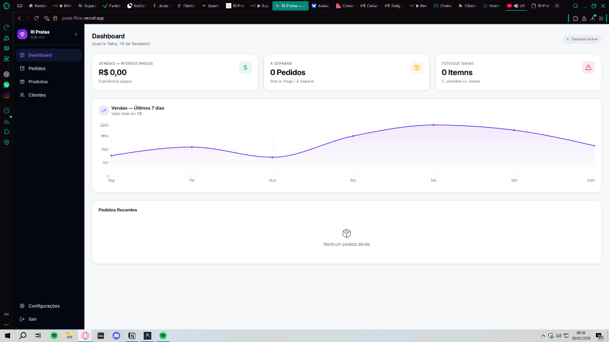

# RI Pratas - Sistema de Operações Digitais (SOD)

> **Status:** Em Produção (Privado)
> **Stack:** React, Vite, TypeScript, Shadcn/ui, Supabase, n8n.

## 🎯 Sobre o Projeto

O **Sistema de Operações Digitais (SOD)** é a espinha dorsal operacional da RI Pratas. Ele foi desenvolvido para substituir uma colcha de retalhos de planilhas e quadros no Notion por uma aplicação Backoffice centralizada e robusta.

Sua principal missão é atuar como a **Fonte da Verdade** para o negócio, sincronizando dados entre a Landing Page (Vendas), o Agente de IA (Atendimento) e a Logística Física (Estoque e Envio).



## 🚀 Funcionalidades Principais (MoSCoW)

### Must Have (O Core)
- **Gestão de Produtos & Estoque:** CRUD completo com controle de variações (tamanhos de anéis) e upload otimizado de imagens.
- **Motor Operacional de Vendas:** Webhooks do Asaas notificam vendas em tempo real, movendo cards no Kanban automaticamente.
- **Pipeline Visual (Kanban):** Gestão de pedidos com drag-and-drop (`Aguardando Pagamento` -> `A Separar` -> `Enviado`).
- **CRM 360:** Perfil unificado do cliente com histórico de pedidos, LTV e preferências de estilo.

### Should Have (Diferenciais)
- **Cálculo de Frete Automatizado:** Integração com Melhor Envio para estimativa de custo e geração de etiquetas.
- **Disparo de Notificações:** O n8n orquestra o envio de mensagens de confirmação e rastreio via WhatsApp.

## 🛠️ Arquitetura Técnica

O projeto segue uma arquitetura moderna e Serverless:

- **Frontend:** React com Vite para performance máxima. Estilização com Tailwind CSS e componentes acessíveis do Shadcn/ui.
- **Backend (BaaS):** Supabase provê Banco de Dados PostgreSQL, Autenticação e Storage de imagens.
- **Orquestração:** n8n atua como "cola", recebendo Webhooks de pagamento e disparando ações em sistemas externos.
- **Segurança:** Políticas de RLS (Row Level Security) garantem que apenas usuários autenticados (sócios) acessem dados sensíveis.

## 📦 Estrutura do Banco de Dados

O schema foi modelado para suportar o crescimento do e-commerce:

```sql
-- Exemplo simplificado das tabelas core
products (id, sku, stock_quantity, ...)
orders (id, customer_id, status, total_amount, ...)
customers (id, phone, ltv, last_purchase_at, ...)
```

## 🎨 Design System

Adotamos um estilo "Minimal Luxury" para refletir a marca RI Pratas, com foco em usabilidade e clareza visual para operação diária.

---
*Este repositório é privado. O acesso ao código-fonte é restrito aos desenvolvedores e sócios da RI Pratas.*
